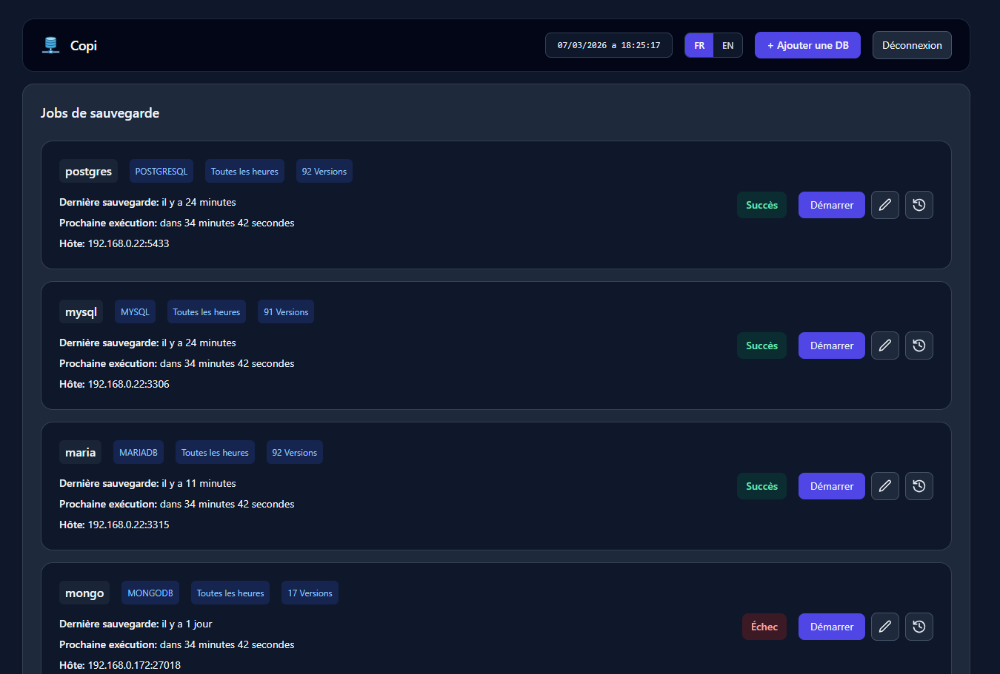

# Copi

English documentation : [README_EN.md](README_EN.md)

Copi est une application web auto-hebergee pour planifier, executer et superviser des sauvegardes de bases de donnees.

Ce produit s'adresse aux personnes qui administrent un serveur personnel (NAS, homelab, mini-PC, VPS, serveur local) et qui veulent fiabiliser leurs sauvegardes de bases de donnees sans multiplier les scripts manuels.

Ce projet a aussi ete concu pour un besoin concret sur mon propre serveur: centraliser et automatiser les sauvegardes de plusieurs moteurs de bases de donnees avec une interface simple.



## A qui s'adresse Copi

- Utilisateurs de NAS (Synology, QNAP, Unraid, TrueNAS, etc.)
- Admins homelab/self-hosted
- Freelances, petites equipes ou devs qui hebergent leurs propres services
- Toute personne qui veut une interface claire pour les sauvegardes DB

## Fonctionnalites

- Gestion des jobs de sauvegarde (creation, edition, suppression)
- Execution manuelle ou planifiee (cron)
- Historique des executions
- Compression des dumps (`NONE`, `GZIP`, `ZIP`)
- Politiques de retention (`NONE`, `COUNT`, `DAYS`)
- Support MySQL, MariaDB, PostgreSQL, MongoDB
- Authentification par session (compte `admin`)

## Stack technique

- Backend: Java 21, Spring Boot, Spring Security, JPA, SQLite
- Frontend: React, Vite, Tailwind CSS
- Outils de dump: `mysqldump`, `mariadb-dump`, `pg_dump`, `pg_dumpall`, `mongodump`

## Arborescence

```text
copi/
|- backend/         # API Spring Boot + logique metier + migrations
|- frontend/        # UI React
|- Dockerfile
|- docker-compose.yml
`- .bash/build.sh   # Build frontend -> copie static -> package backend
```

## Prerequis

### Option 1 - Docker (recommande)

- Docker
- Docker Compose

### Option 2 - Developpement local

- Java 21
- Maven 3.9+
- Node.js 20+ et npm
- Outils de dump installes localement et accessibles dans le `PATH`

## Demarrage rapide (Docker)

Depuis la racine du projet:

```bash
docker compose up -d --build
```

Application disponible sur:

- [http://localhost:8092](http://localhost:8092)

Identifiants par defaut:

- utilisateur: `admin`
- mot de passe: `copi` (via `COPI_ADMIN_PASSWORD` dans `docker-compose.yml`)

Arret:

```bash
docker compose down
```

## Developpement local

### 1) Backend

Depuis `backend/`:

```bash
./mvnw spring-boot:run -Dspring-boot.run.profiles=dev
```

Sous Windows PowerShell:

```powershell
.\mvnw.cmd spring-boot:run "-Dspring-boot.run.profiles=dev"
```

Backend expose par defaut sur `http://localhost:8080`.

### 2) Frontend

Depuis `frontend/`:

```bash
npm install
npm run dev
```

Frontend disponible sur `http://localhost:5173`.
Le proxy Vite redirige `/api` vers `http://localhost:8080`.

## Build de production

### Build complet via script bash

Le script `.bash/build.sh`:

1. Build le frontend (`npm run build`)
2. Copie `frontend/dist` dans `backend/src/main/resources/static`
3. Package le backend (`mvn clean package -DskipTests`)

Commande:

```bash
bash .bash/build.sh
```

## Configuration (variables d'environnement)

Variables principales:

- `SPRING_PROFILES_ACTIVE` (`dev` ou `prod`)
- `COPI_ADMIN_PASSWORD` (mot de passe admin)
- `MASTER_KEY` (cle de chiffrement interne)
- `SERVER_PORT` (port backend, defaut `8080`)
- `SESSION_TIMEOUT` (minutes, defaut `30`)
- `SPRING_DATASOURCE_URL` (defaut `jdbc:sqlite:/config/copi.db`)
- `APP_BACKUP_DIR` (defaut `/app/backups`)
- `MYSQLDUMP_PATH`, `MARIADUMP_PATH`, `PGDUMP_PATH`, `PGDUMPALL_PATH`, `MONGODUMP_PATH`

En Docker, ces variables sont preconfigurees dans `docker-compose.yml`.

## API principale

- `POST /api/login` : connexion
- `POST /api/logout` : deconnexion
- `GET /api/auth/check` : verification de session
- `GET /api/session/config` : timeout de session
- `GET /api/jobs` : liste des jobs
- `POST /api/jobs` : creation d'un job
- `PUT /api/jobs/{id}` : mise a jour d'un job
- `DELETE /api/jobs/{id}` : suppression d'un job
- `POST /api/jobs/{id}/start` : execution manuelle
- `GET /api/executions` : historique global
- `GET /api/executions/{jobId}` : historique d'un job

## Donnees persistantes

- Metadonnees applicatives SQLite:
  - local: `backend/data/copi.db`
  - docker: bind mount `./backend/config:/config` vers `/config/copi.db`
- Fichiers de sauvegarde:
  - local: `backend/backups/`
  - docker: volume `copi_backups` monte sur `/app/backups`

## Bonnes pratiques en production

- Changer au minimum:
  - `COPI_ADMIN_PASSWORD`
  - `MASTER_KEY`
- Proteger l'acces reseau (VPN, reverse proxy, firewall)
- Verifier regulierement la restauration des dumps
- Sur NAS, monter un stockage persistant dedie aux sauvegardes

